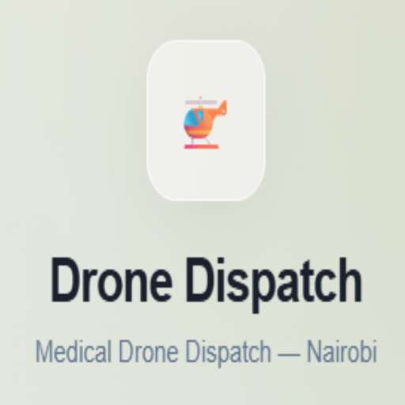
# Drone Dispatch — AI Drone Delivery for Medical Emergencies

[](https://opensource.org/licenses/MIT)
[](https://github.com/yourusername/pocket-pilot)
[](https://pocket-pilot.vercel.app)

```
Drone Dispatch is an AI-powered drone delivery dispatch system for medical emergencies in Nairobi. It pairs a customer-facing shop and live tracking app with an operator command center that plans and flies drone routes in 3D — built by [your name] and Teddy Ngugi Nderitu.
```

## Preview (hero section)
<p align="center">
  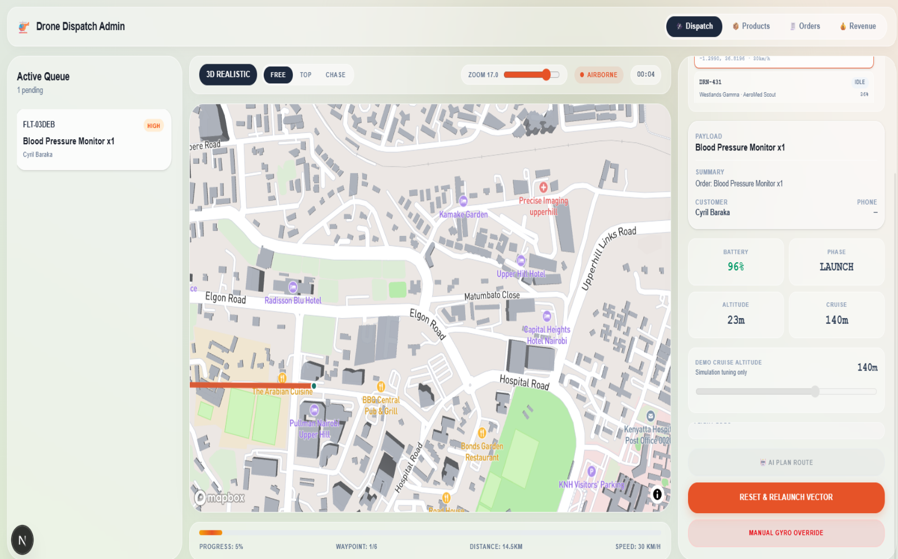
</p>

## The Idea
<!-- TODO (your voice): why this project, why Nairobi, why medical delivery, what the hackathon/context was, how you and Teddy split the work, any moment you're proud of. Mirror the personal, slightly self-deprecating tone from your Mor Cakes README here. -->

## Technologies Used

### Frontend
* [Next.js 16](https://nextjs.org/) (App Router) + TypeScript
* [Tailwind CSS 4](https://tailwindcss.com/)
* [Mapbox GL JS](https://www.mapbox.com/mapbox-gljs) for 3D city maps
* [Three.js](https://threejs.org/) + [React Three Fiber](https://docs.pmnd.rs/react-three-fiber) for the live drone flight visualization
* Browser-native Speech Recognition for the emergency voice dispatcher

### Backend / Platform
* [Supabase](https://supabase.com/) — Postgres database, Auth (email OTP), and Realtime channels for live telemetry
* [Anthropic Claude](https://www.anthropic.com/) (`claude-sonnet-4-6`) — primary AI engine for emergency parsing and flight route planning
* [Google Gemini 2.0 Flash](https://ai.google.dev/) — automatic AI fallback provider
* [Africa's Talking](https://africastalking.com/) / [Twilio](https://www.twilio.com/) — SMS delivery notifications (auto-fallback chain, mock mode when unconfigured)

## Pages

The app has two front doors — a customer app and an operator command center — sharing one entry point.

- **Auth (app/auth)**: The entry point for everyone. Customers sign up or sign in with email OTP — Supabase sends a 6-digit code instead of a magic link — with a quiet link through to the admin console for operators.

<p align="center">
  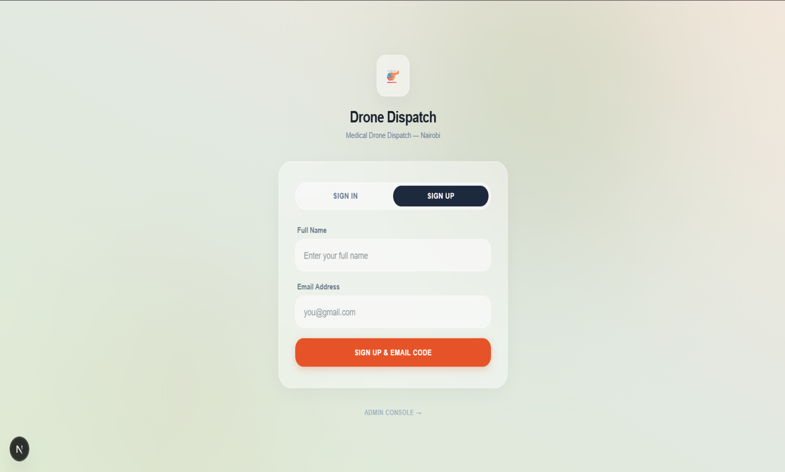
</p>

- **Customer — Shop**: Product catalog (First Aid, Medication, Equipment, Emergency categories) with search, categories, and cart.

<p align="center">
  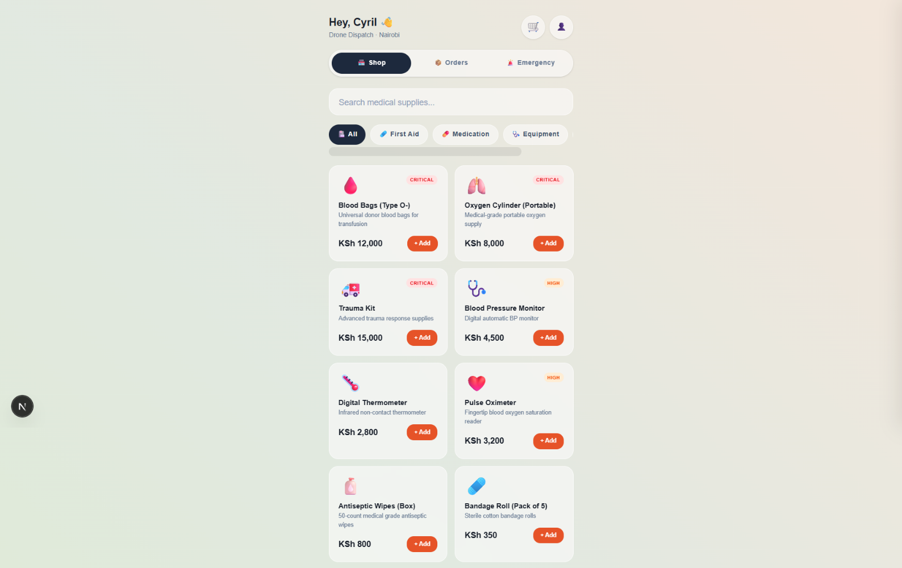
</p>

- **Customer — Cart & Checkout**: Cart drawer with quantity controls, checkout, and order confirmation, prices in KSh.

<p align="center">
  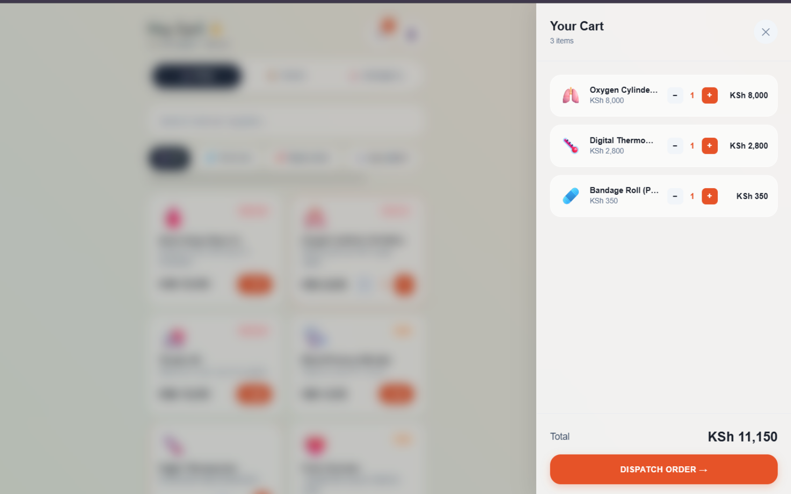
</p>

- **Customer — Emergency Voice Dispatch**: The panel I'm most proud of. Speak an emergency in plain language, Claude transcribes and parses it into a structured, prioritized ticket — no cart, no forms.

<p align="center">
  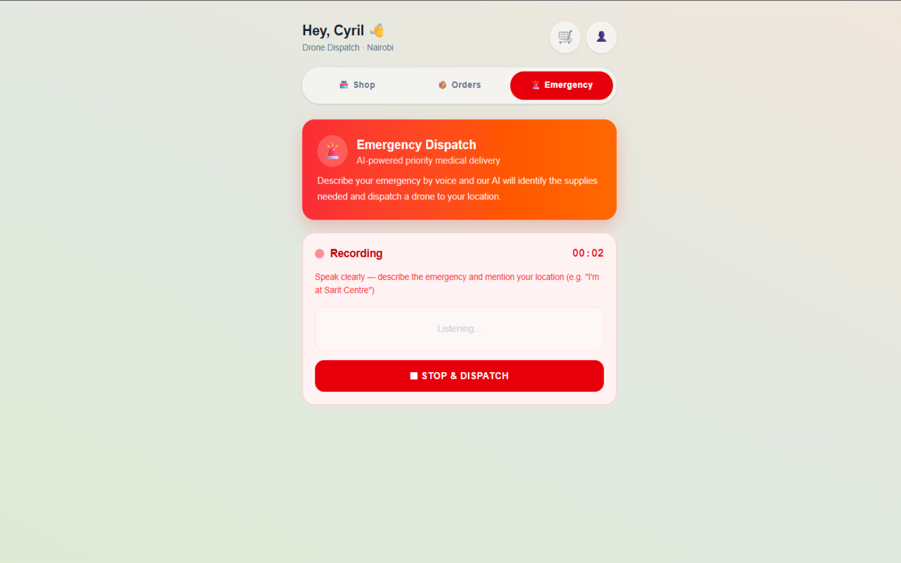
</p>

- **Customer — Live Order Tracking**: Map view of the assigned drone's live position, battery, speed, and route, with a delivery status timeline.

<p align="center">
  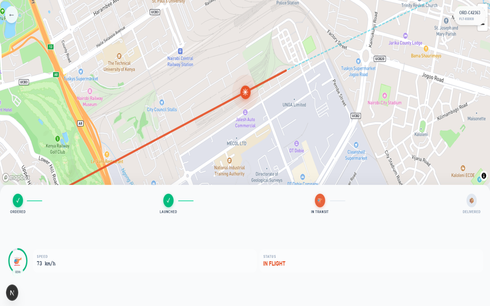
</p>

---
---

- **Admin — Command Center**: The operator's dispatch queue and live fleet tracker — every drone's base, model, and battery at a glance, idle and ready.

<p align="center">
  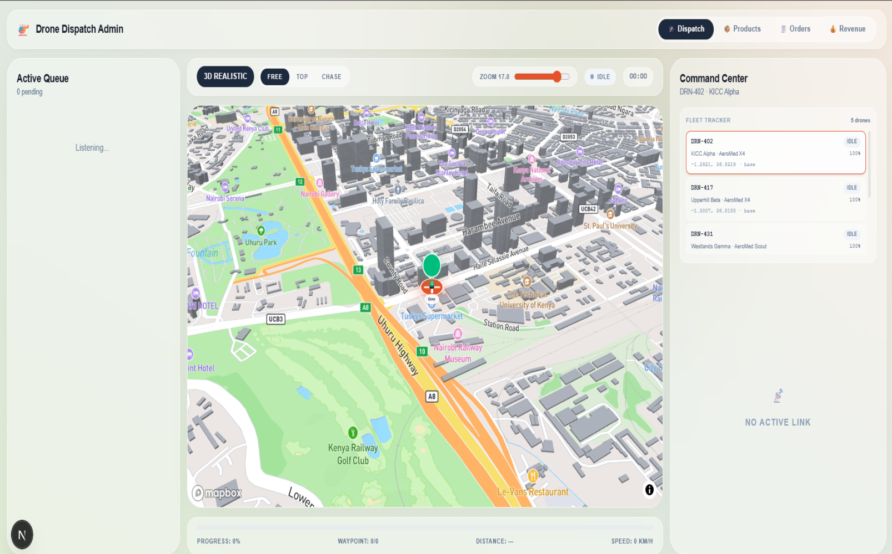
</p>

- **Admin — 3D FPV Flight Map**: The flagship feature. Mapbox GL + Three.js render a live 3D drone flying its AI-planned route over real Nairobi terrain, with hazard-aware waypoints (CBD towers, JKIA corridor, embassy zones). The operator can watch a route get planned and launched in real time.

<p align="center">
  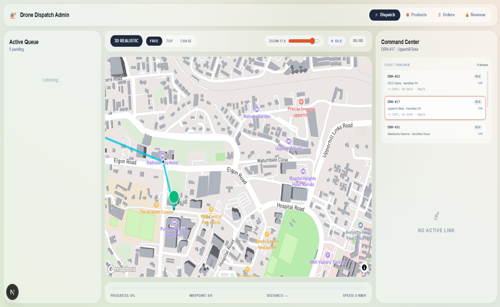
</p>

Mid-flight, the same map shows live telemetry — battery, altitude, phase — and gives the operator manual override controls if something needs to change.

<p align="center">
  
</p>

- **Admin — Orders / Purchase Log**: Every order ever placed, with buyer, payload, destination coordinates, and dispatch ticket status — plus running totals for orders, in-flight, and delivered.

<p align="center">
  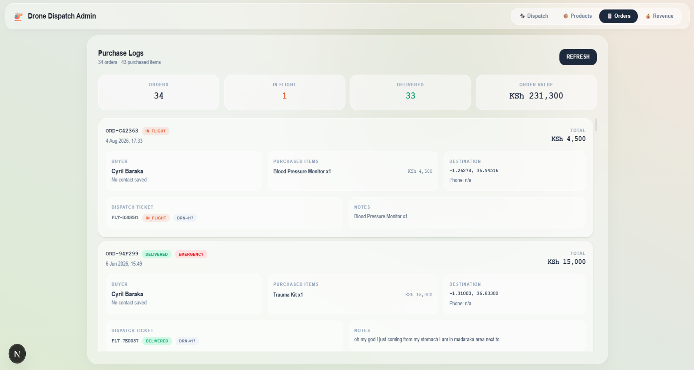
</p>

- **Admin — Revenue**: Revenue totals, order status breakdown, and a running feed of recent deliveries.

<p align="center">
  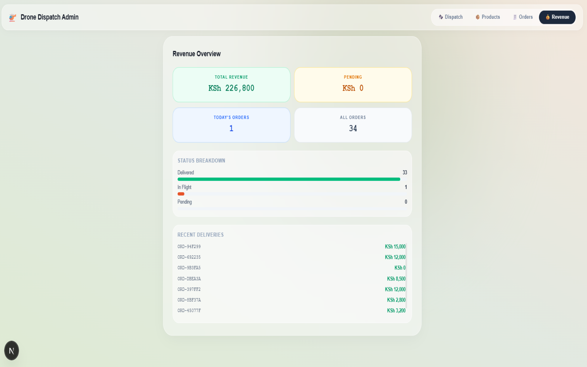
</p>

## Fleet

| ID | Name | Model | Base | Max Payload |
|----|------|-------|------|-------------|
| DRN-402 | KICC Alpha | AeroMed X4 | CBD (-1.2921, 36.8219) | 4.5 kg |
| DRN-417 | Upperhill Beta | AeroMed X4 | Upperhill (-1.3007, 36.8155) | 4.5 kg |
| DRN-431 | Westlands Gamma | AeroMed Scout | Westlands (-1.2645, 36.8026) | 3.2 kg |
| DRN-448 | Industrial Delta | AeroMed Cargo | Industrial Area (-1.3141, 36.8499) | 6.0 kg |
| DRN-463 | Langata Echo | AeroMed X4 | Langata (-1.3521, 36.7544) | 4.5 kg |

## Features

- **AI flight planner**: Claude generates waypoint routes from any drone base to any Nairobi destination, reasoning around airspace hazards specific to that route's bearing
- **Emergency voice dispatch**: speech recognition feeds a transcript to AI, which matches it to inventory and auto-creates a prioritized ticket with coordinates
- **Real-time fleet telemetry**: Supabase Realtime pushes drone position, altitude, battery, and flight phase at 250ms intervals
- **3D FPV map**: Mapbox GL + Three.js renders a live drone model flying the planned route over Nairobi terrain
- **Order system**: cart, checkout, order history, and admin product/revenue management
- **SMS notifications**: proximity delivery alerts via Africa's Talking or Twilio, with automatic fallback to mock logging

## Project Structure

```
pocket-pilot/
├── drone-dispatch/
│   ├── app/
│   │   ├── page.tsx                  # Landing page
│   │   ├── auth/                     # Email OTP authentication
│   │   ├── customer/                 # Customer shop, cart, order tracking
│   │   ├── admin/                    # Operator command center
│   │   ├── api/
│   │   │   ├── dispatch/             # AI text → ticket extraction
│   │   │   ├── emergency-voice/      # AI voice transcript → order + ticket
│   │   │   ├── missions/
│   │   │   │   ├── plan-route/       # AI waypoint + altitude planner
│   │   │   │   └── command/          # Drone command handler (launch, hold, RTB…)
│   │   │   ├── orders/               # Order CRUD
│   │   │   └── products/             # Product CRUD
│   │   ├── components/
│   │   │   ├── FPVMap.tsx            # 3D Mapbox drone visualizer
│   │   │   ├── EmergencyPanel.tsx    # Voice capture UI
│   │   │   ├── ProductGrid.tsx       # Shop grid
│   │   │   ├── CartDrawer.tsx        # Cart / checkout
│   │   │   ├── OrderHistory.tsx      # Customer order tracking
│   │   │   ├── ProductManager.tsx    # Admin product CRUD
│   │   │   ├── RevenuePanel.tsx      # Admin revenue analytics
│   │   │   └── PurchaseLogPanel.tsx  # Admin purchase log
│   │   └── lib/
│   │       ├── fleet.ts              # Drone fleet definitions
│   │       ├── simulator.ts          # Flight physics & path interpolation
│   │       └── ai-client.ts          # Anthropic + Gemini wrapper
│   └── schema.sql                    # Supabase table definitions
```

## API Endpoints

- `POST /api/dispatch` — AI text → ticket extraction
- `POST /api/emergency-voice` — AI voice transcript → order + ticket
- `POST /api/missions/plan-route` — AI waypoint + altitude flight planner
- `POST /api/missions/command` — drone command handler (launch, hold, RTB…)
- `GET/POST /api/orders` — order CRUD
- `GET/POST /api/products` — product CRUD

## Development Process
<!-- TODO (your voice): how this got built — planning, hackathon timeline, how the AI planner/voice dispatch came together, what was hardest. Mirror your Mor "Development Process" numbered list. -->

## Setup and Installation

### Prerequisites
- Node.js (v18 or higher)
- A [Supabase](https://supabase.com/) project
- A [Mapbox](https://www.mapbox.com/) access token
- An [Anthropic](https://console.anthropic.com/) API key (Gemini key optional, as fallback)

### Installation

1. **Clone the repository**
   ```bash
   git clone https://github.com/yourusername/pocket-pilot.git
   cd pocket-pilot/drone-dispatch
   npm install
   ```

2. **Set up the database**
   Run `schema.sql` in your Supabase SQL editor to create the `products`, `orders`, `tickets`, `customers`, and `drone_telemetry` tables.

3. **Environment Setup**
   ```bash
   cp .env.local.example .env.local
   ```
   Then fill in:
   ```env
   # Supabase
   NEXT_PUBLIC_SUPABASE_URL=
   NEXT_PUBLIC_SUPABASE_PUBLISHABLE_KEY=

   # Mapbox
   NEXT_PUBLIC_MAPBOX_ACCESS_TOKEN=

   # AI (default: anthropic)
   AI_PROVIDER=anthropic
   ANTHROPIC_API_KEY=
   # GOOGLE_AI_API_KEY=      # only needed if AI_PROVIDER=gemini

   # SMS (optional — falls back to mock logging if unset)
   SMS_PROVIDER=auto
   ```

4. **Email OTP template**
   In the Supabase Dashboard, update the Magic Link email template to include `{{ .Token }}` (not just `{{ .ConfirmationURL }}`), so customers receive the 6-digit code this app expects.

5. **Run the app**
   ```bash
   npm run dev
   ```
   Open [http://localhost:3000](http://localhost:3000).

## Lessons Learned
<!-- TODO (your voice): technical + business takeaways, mirroring your Mor structure (Technical Skills / Development Practices / Business Understanding). You already have the raw material in summary.md and CUSTOMER_SIDE_DEEP_DIVE.md if you want to pull from there. -->

## Acknowledgments
<!-- TODO (your voice): Teddy, hackathon organizers/judges if applicable, any libraries or mentors worth a callout. -->

## License

<!-- TODO: confirm license + contact line, matching your Mor closing note -->

## Contact

For questions, reach out to [your email] or open an issue.

**If you found this project interesting, please give it a star!**
